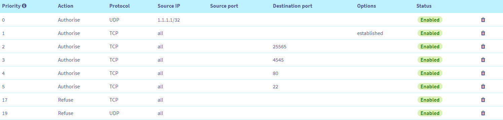

Iptables rules
============
> Here is an example of firewall rules that can be used for a minecraft server, to block exploits...

> In this firewall I used a special approach which is to block only illegitimate connections. This firewall MUST therefore be used with a "network" firewall that will block requests before they reach your server.
> Below is an example of a firewall "network" in OVHCloud.

> This will block the biggest attacks even before they arrive on your server and then via the firewall template that I am offering you, we block the rest.

How it works ?
============
> Download the [script](https://github.com/GaetanOff/Firewall-Template/blob/master/rules), modify it to adapt it to your own ports and run it. 

How can I reset the rules ?
============
> Download and run the [reset](https://github.com/GaetanOff/Firewall-Template/blob/master/reset) file in the repo.
